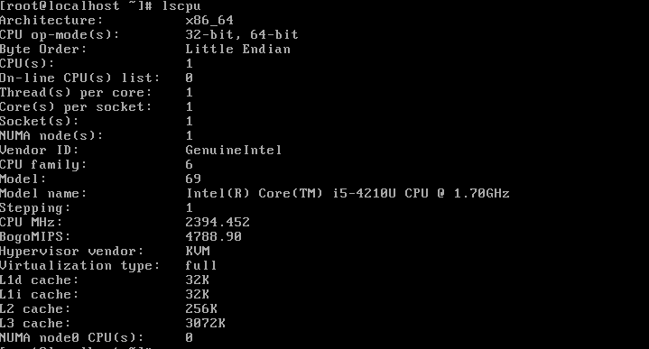
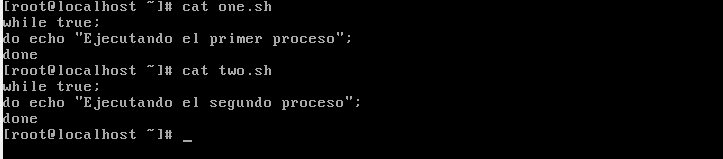
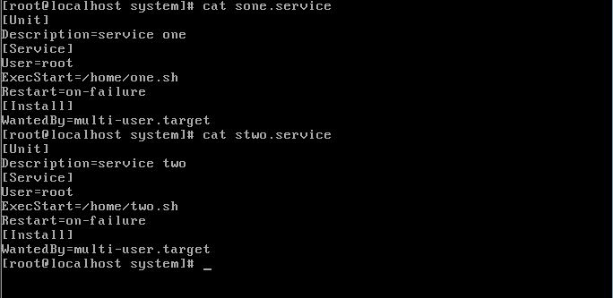
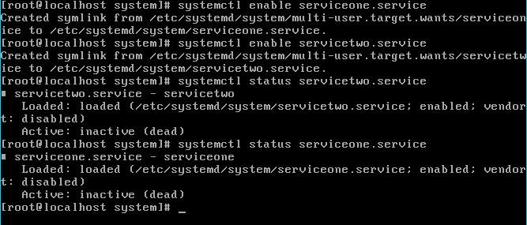
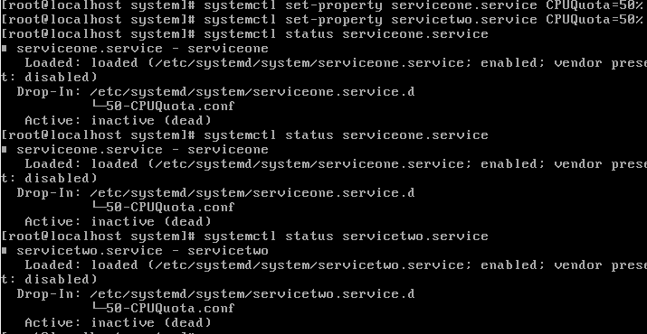
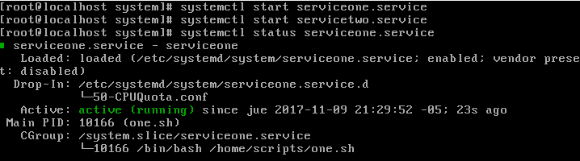
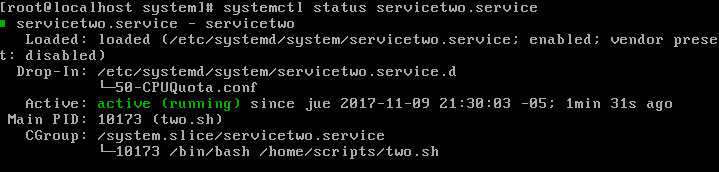
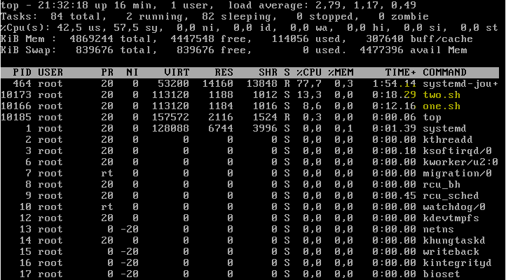
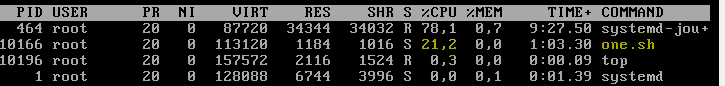

### Examen 2
**Universidad ICESI**  
**Curso:** Sistemas Operativos  
**Docente:** Daniel Barragán C.  
**Tema:** Namespaces, CGroups, LXC  
**Correo:** daniel.barragan at correo.icesi.edu.co  
**Estudiante:** Jhon Eduar Tobar Gómez  
**Codigo:** A00316212  
**URL Github:** https://github.com/Jhongomez6/so-exam2  

### Objetivos
* Comprender los fundamentos que dan origen a las tecnologías de contenedores virtuales
* Conocer y emplear funcionalidades del sistema operativo para asignar recursos a procesos
* Conocer y emplear capacidades de CentOS7 para la virtualización

### Prerrequisitos
* Virtualbox o WMWare
* Máquina virtual con sistema operativo CentOS7

### Descripción
El segundo parcial del curso sistemas operativos trata sobre el manejo de namespaces, cgroups y virtualización por medio de LXC/LXD

### Actividades
1. Incluir nombre, código (5%)
2. Ortografía y redacción cuando sea necesario (5%)
3. Realice una prueba de concepto empleando systemd y el recurso de control CPUQuota teniendo en cuenta los requerimientos que se describen a cotinuación. Incluya evidencias del funcionamiento de lo solicitado (30%):
 * Las pruebas se realizaran sobre un solo núcleo de la CPU
 * Se deben ejecutar dos procesos
 * Cada proceso debe poder acceder solo al 50% de la CPU
 * Cuando uno de los procesos se cancela, el que continua ejecutándose no debe acceder a mas del 50% de la CPU
4.  Realice una prueba de concepto empleando systemd y el recurso de control CPUShares teniendo en cuenta los requerimientos que se describen a continuación. Incluya evidencias del funcionamiento de lo solicitado (30%):
 * Las pruebas se realizaran sobre un solo núcleo de la CPU
 * Se deben ejecutar dos procesos
 * Uno de los procesos tendrá el 25% de la CPU mientras que el otro tendrá el 75% de la CPU
 * Cuando uno de los procesos se cancela, el que continua ejecutándose debe poder llegar al 100% de la CPU
5. Por medio de las evidencias obtenidas en los puntos anteriores y de fuentes de consulta en Internet, elabore las definiciones para los grupos de control CPUQuota y CPUShares, además concluya acerca de cuando es preferible usar un recurso de control sobre otro (20%)
6. El informe debe ser entregado en formato pdf a través del moodle y el informe en formato README.md debe ser subido a un repositorio de github. El repositorio de github debe ser un fork de https://github.com/ICESI-Training/so-exam2 y para la entrega deberá hacer un Pull Request (PR) respetando la estructura definida. El código fuente y la url de github deben incluirse en el informe (10%)  

### Solución

3. Prueba de concepto systemd y CPUQuota.

Primero verificamos que las pruebas a ejecutar sean en un solo nucleo de la CPU:

Ahora bien, se requiere ejecutar dos procesos por lo que procedemos a crear los scripts que ejecutarán estos procesos:

Despues de haber creado los scripts, pasamos a configurar los servicios correspondientes para cada script:

Verificamos que los servicios se hayan cargado correctamente:

El siguiente paso es asignar a cada proceso el acceso a solo el 50% de la CPU y verificar que se haya configurado correctamente:

Ahora ejecutamos ambos servicios con los comandos que se muestran a continuación y asi mismo, verificamos que el estado sea running, es decir que este ejecutandose:

Proceso 1:

Proceso 2:

Y por ultimo miramos que los procesos no esten utilizando más del 50% de la CPU con el comando top:

Si detenemos el servicetwo.service podemos apreciar que el otro servicio sigue corriendo sin problema y sin utilizar más del 50% de la CPU debido a la condiguración de la CPUQuota:

### Referencias
https://github.com/ICESI/so-containers
